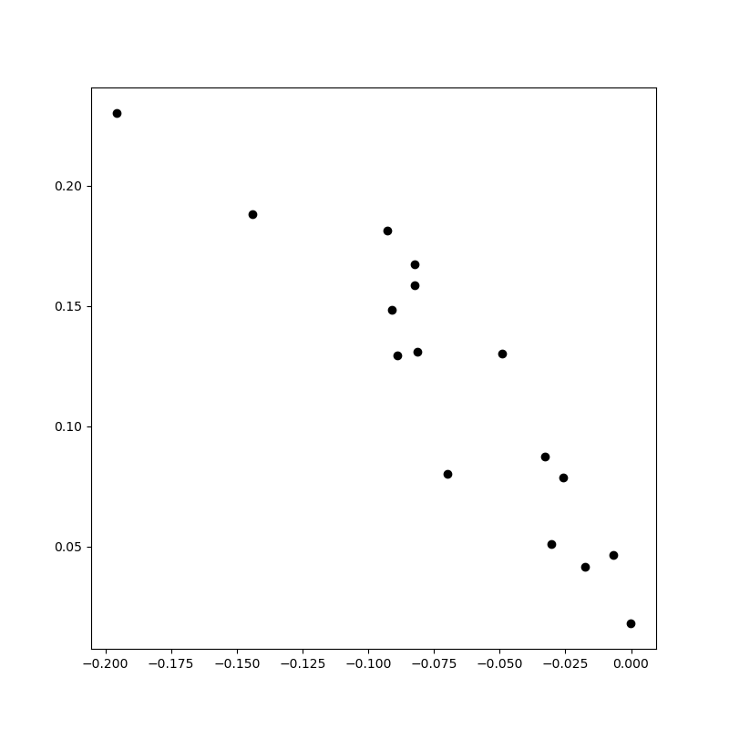
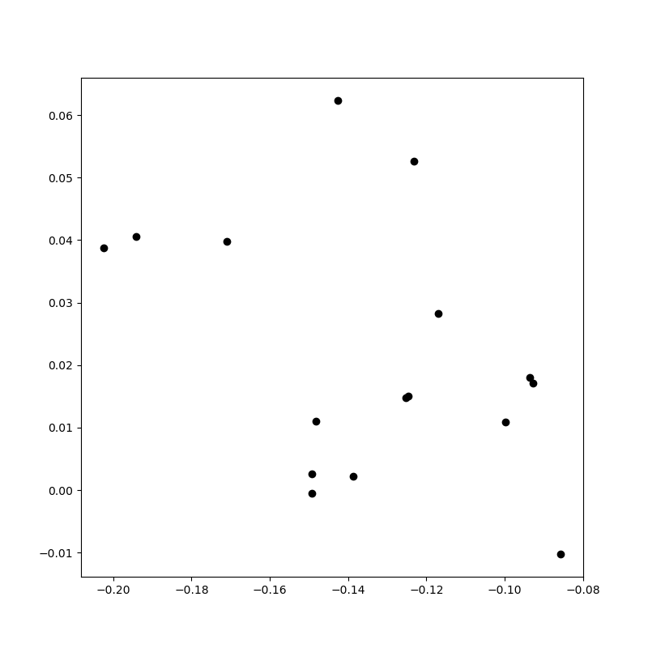
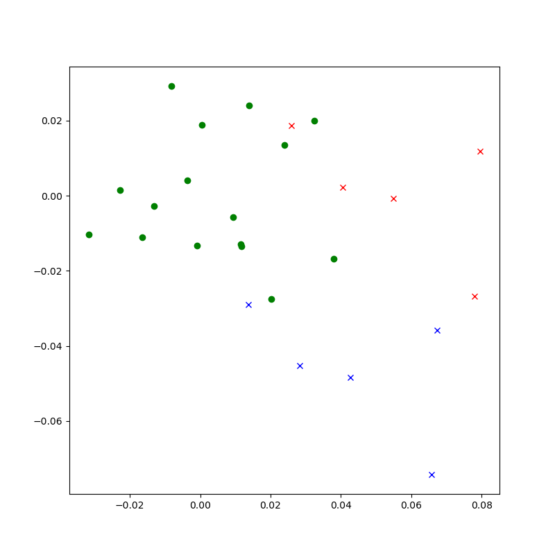
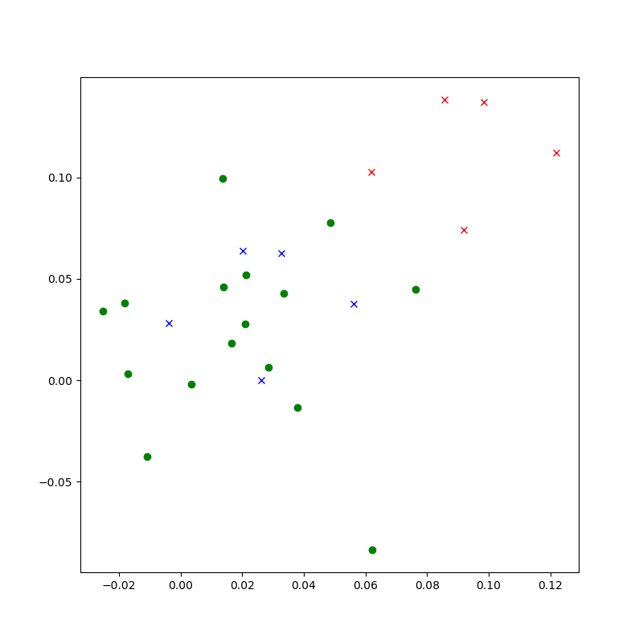
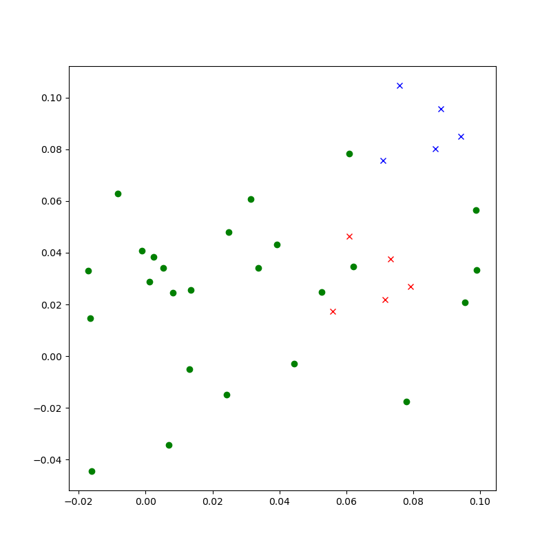
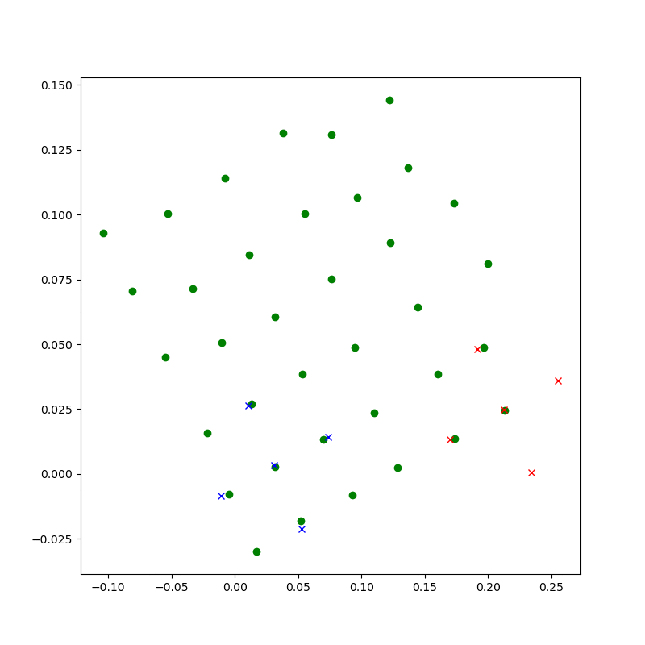

# Experiment: Structured Latent Space

### Idea: Induce structure in the latent space to mirror the input transition-topology in the latent space.

A simple action conditioned MLP auto-encoder is used. Actions are mapped (state-independent) through an MLP and added to the 2D encoder latent projection. Input is a grid start-position (one-hot encoded) + action (one-hot encoded). Target is the resulting position on the grid (also one-hot-encoded). The one-hot encoding of the inputs is used as example for arbitrary state-patterns.

The action-space consists of 5 discrete actions: N, S, W, E and stay (invalid actions are replaced by stay, e.g. when agent would leave grid).

To directly visualize the latent space the bottleneck-layer of the auto-encoder is 2D.

Initially the model has no information about the meaning of different actions or how input patterns relate to each other.

For each action a fixed latent space offset is learned (independent of the source position) which is added to the 2D latent-encoding of the encoder to 'predict' the destination position.


## Results

It works to some extend but was more brittle than I had expected. The code was tested for input grids up to 6x6. For larger inputs a different model would be required (it did not immediately work when grid is set to 8x8).


```
Example:

6x6 grid

Input:
[0., 0., 0., 0., 0., 0.],
[0., 0., 0., 0., 0., 0.],
[0., 0., 0., 0., 0., 0.],
[0., 1., 0., 0., 0., 0.],
[0., 0., 0., 0., 0., 0.],
[0., 0., 0., 0., 0., 0.]

Action: 
[1, 0, 0, 0, 0] (North)

Target:
[0., 0., 0., 0., 0., 0.],
[0., 0., 0., 0., 0., 0.],
[0., 1., 0., 0., 0., 0.],
[0., 0., 0., 0., 0., 0.],
[0., 0., 0., 0., 0., 0.],
[0., 0., 0., 0., 0., 0.]
```

## Latent space during training

The animated GIFs show plots of the 2D latents during training for all input grid positions.







